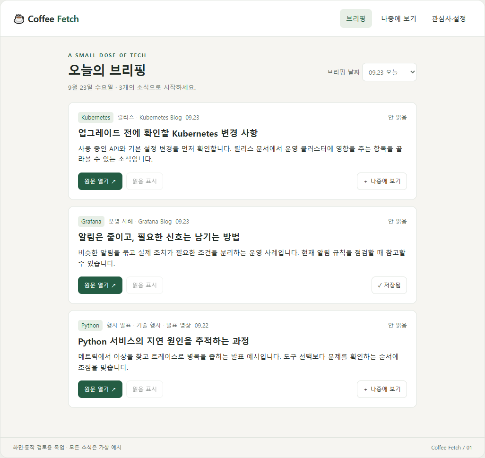
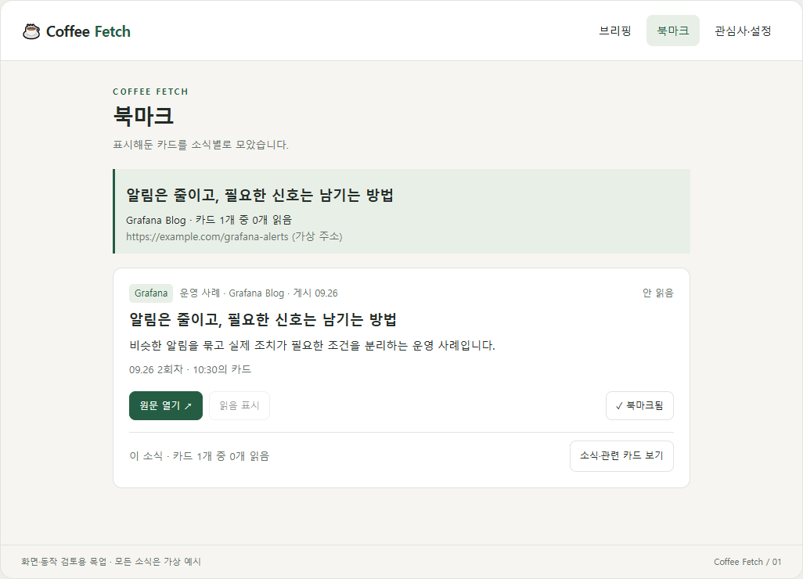
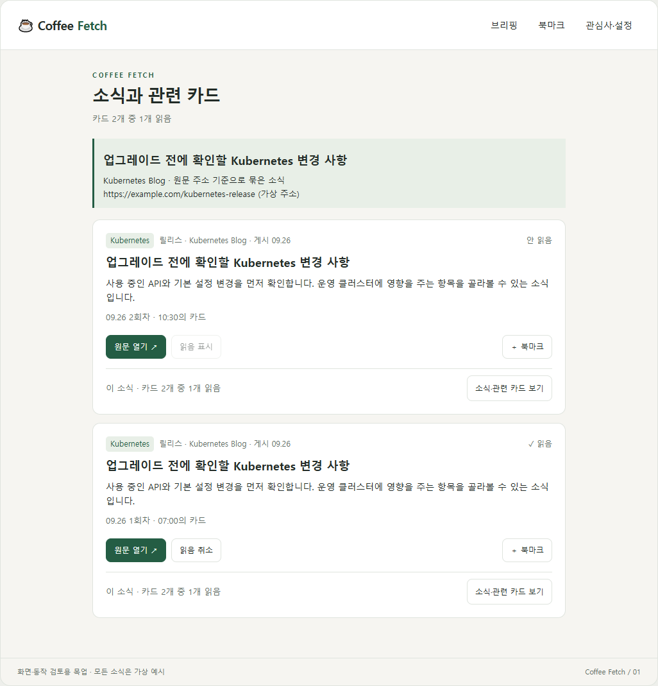
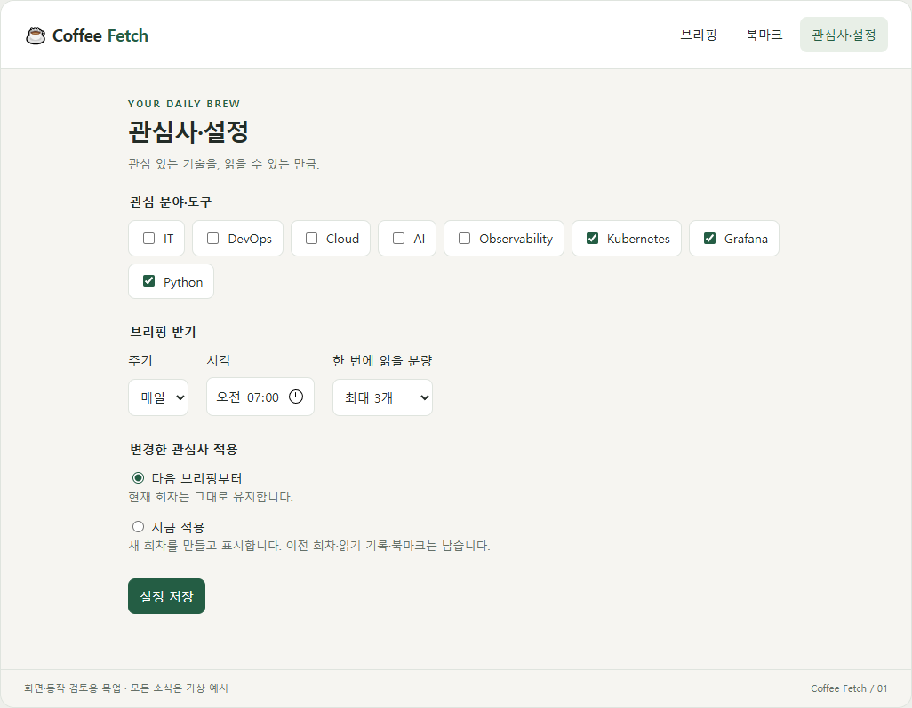
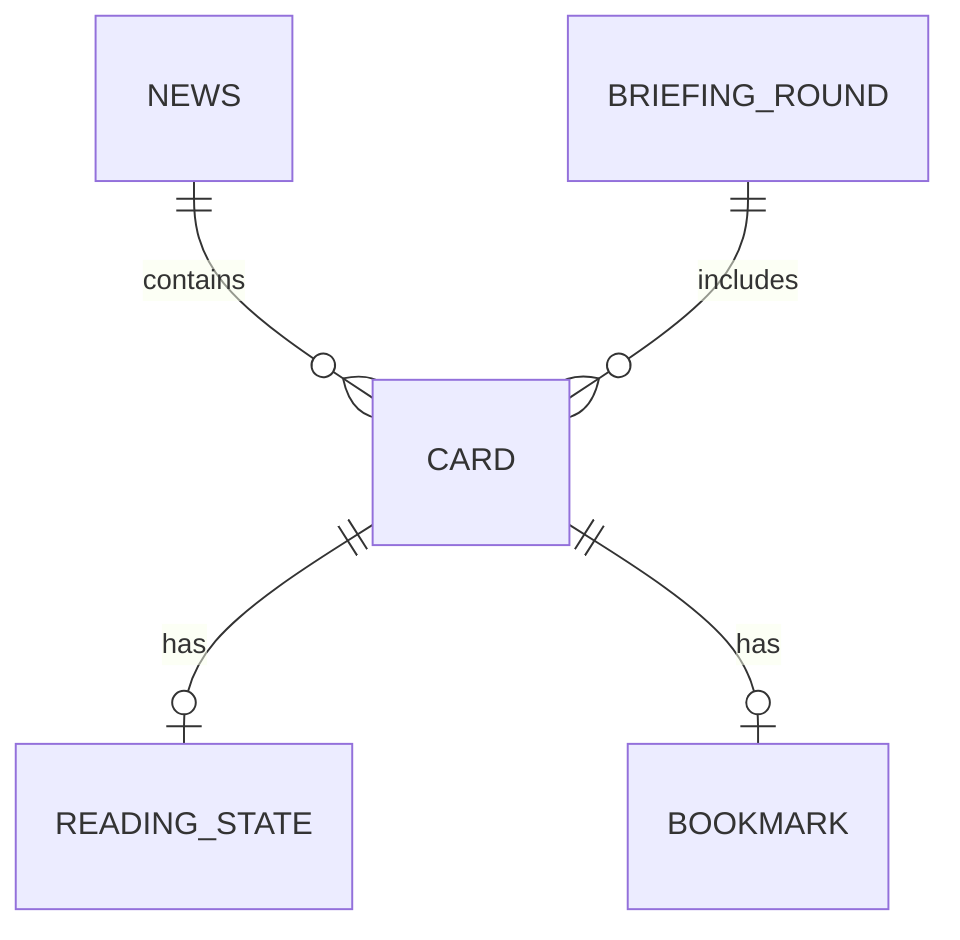

# Coffee Fetch — 현재 제품 정의

## 목적

관심 기술의 새 소식을 부담 없는 양으로 읽습니다. 개인적인 재미를 위해 만들고, 만드는 과정에서 AI를 어떻게 활용할지 배웁니다. 별도의 학습 목표 개수나 일정은 강제하지 않습니다.

관심 분야는 IT·DevOps·Cloud·AI·Observability, 관심 도구는 Kubernetes·Grafana·Python 등입니다. 기본 사용에 고민 입력은 필요하지 않습니다.

## 첫 버전 범위

| 구분 | 내용 |
|---|---|
| 초기 설정 | 관심 분야·도구, 받을 주기, 읽을 분량 |
| 화면 | 짧은 요약 카드와 원문 링크 |
| 행동 | 원문 열기, 카드별 명시적 읽음 표시, 북마크 |
| 기록 | 지난 브리핑 회차와 북마크한 카드 |
| 보류 | 고민 기반 추천, 저녁 회고, 학습·복습 기능, 관심 줄이기 |

## 화면과 동작

2026-09-23 대화에서 검토한 목업을 첫 버전의 작업 기준으로 사용합니다. 화면 배치·스타일·메뉴 구성은 변경 가능한 초안입니다. 아래 동작을 유지하면서 화면 구성을 바꿀 수 있습니다. 목업 소식은 가상 예시이며 실제 수집·요약 품질을 검증한 결과는 아닙니다.

### 1. 브리핑

| 요소·행동 | 표시·동작 |
|---|---|
| 브리핑 열기 | 가장 최신 회차를 기본 표시. 날짜를 선택하면 해당 날짜의 최신 회차 표시 |
| 회차 선택 | 같은 날 생성된 이전 회차도 선택 가능. 재생성은 덮어쓰지 않고 새 회차로 보관 |
| 소식 카드 | 제목, 짧은 요약, 출처, 원문 링크, 게시일, 자료 유형, 관련 기술, 카드별 읽기·북마크 상태 |
| 원문 열기 | 외부 원문을 새 탭으로 열고 해당 카드의 ‘안 읽음’을 ‘읽는 중’으로 변경. 이미 읽은 카드는 읽음 유지 |
| 읽음 표시 | 사용자가 다 읽었다고 판단한 뒤 직접 ‘읽음’으로 표시 |
| 읽음 취소 | 실수로 표시했다면 ‘읽는 중’으로 되돌림 |
| 북마크 | 해당 카드를 북마크하거나 해제. 읽기 상태와 독립적으로 동작 |
| 소식·관련 카드 보기 | 원문 주소로 묶인 소식의 제목·출처·주소와 관련 카드 목록, 전체 카드 수·읽은 카드 수 표시 |
| 날짜 선택 | 오늘 이전 날짜의 브리핑을 당시 목록·순서·요약 그대로 표시 |

외부 원문의 스크롤이나 완독 여부는 자동 판정하지 않습니다. 카드별 읽기·북마크 상태는 같은 카드를 표시하는 화면 사이에서만 공유합니다. 같은 원문이라도 다른 회차의 카드는 별도로 읽음 처리합니다. 소식의 읽은 카드 수는 전체 보관 회차의 관련 카드에서 계산하고, 모두 읽었으면 소식에 ‘다 읽음’을 표시합니다.

### 2. 북마크와 소식 보기

| 요소·행동 | 표시·동작 |
|---|---|
| 북마크 목록 | 북마크한 카드를 소식별로 묶어 표시 |
| 소식 구분 | 소식 제목·출처·원문 주소를 함께 표시하여 카드가 어떤 소식인지 확인 가능 |
| 카드 구분 | 카드가 만들어진 날짜·회차와 당시 내용을 표시 |
| 관련 카드 | 소식 보기에서 북마크하지 않은 카드까지 포함한 전체 관련 카드와 읽기 진행 확인 |
| 북마크 해제 | 표시만 제거. 카드·브리핑·읽음 기록은 그대로 유지 |
| 빈 목록 | 북마크한 카드가 없음을 표시 |

북마크는 카드에 붙는 표시입니다. 별도 사본을 만들지 않고 이미 보존된 카드의 당시 내용을 다시 보여줍니다. 읽음 처리·관심사 변경·재생성으로 북마크가 없어지지 않습니다.

### 3. 관심사·설정

| 요소·행동 | 표시·동작 |
|---|---|
| 관심 분야·도구 | 받고 싶은 분야와 도구 선택. 최소 하나 필요 |
| 받을 주기·시각 | 브리핑 생성 주기와 시각 설정 |
| 읽을 분량 | 브리핑당 최대 소식 수 설정. 부족한 소식을 억지로 채우지 않음 |
| 다음 브리핑부터 적용 | 변경을 저장하고 현재 브리핑은 유지. 다음 생성부터 새 설정 사용 |
| 지금 적용 | 변경한 관심사로 새 회차를 생성하고 표시. 기존 모든 회차와 카드별 읽음·북마크 유지 |

목업의 매일 07:00·최대 3개는 예시이며 기본값 확정이 아닙니다. 즉시 적용은 오늘의 새 회차 생성입니다. 생성 과정의 세부 규칙은 아래 미결정 항목에서 다룹니다.

### 처리 중·빈 결과·실패

다음은 구현 시 사용할 기본 동작안입니다. 목업에서는 모든 상태를 재현하지 않았습니다.

- 생성 중: 처리 중임을 표시하고 같은 요청의 중복 실행 방지. 기존 브리핑은 계속 읽을 수 있게 유지.
- 새 소식 없음: 정상 처리 결과가 비어 있음을 표시.
- 수집·요약 실패: 새 소식 없음과 구분하고 재시도 가능하게 표시. 기존 브리핑은 유지.
- 상태 저장 실패: 읽음·북마크가 완료된 것처럼 표시하지 않고 실패와 재시도 안내.

## 목업 캡처

화면 구성 검토용 가상 데이터입니다. 배치와 스타일은 추후 변경할 수 있습니다. [클릭 가능한 목업 원본](mockup/index.html)은 내려받아 브라우저에서 열 수 있습니다.

### 브리핑



### 북마크



### 소식과 관련 카드



### 관심사·설정



<details>
<summary>목업 캡처 다시 만들기</summary>

Playwright를 사용합니다. 캡처 명령은 [tools/capture-mockup.cjs](../../tools/capture-mockup.cjs)에 있습니다. 캡처용 브라우저는 독립 프로필과 네트워크 차단 상태에서 HTML 내용만 렌더링합니다.

Windows에는 Playwright를 전역 설치했으며 기존 Edge를 사용합니다. 저장소 루트에서 실행:

```powershell
$env:NODE_PATH = (npm root -g)
node tools/capture-mockup.cjs
```

WSL에서 처음 사용할 때:

```bash
npm install --global playwright
playwright install --with-deps chromium
NODE_PATH=$(npm root -g) node tools/capture-mockup.cjs
```

네 PNG를 갱신하고 회차 전환·카드별 읽음·소식별 집계·북마크·재생성 보존, 360px 화면의 가로 넘침, JavaScript 실행 오류를 확인합니다. WSL 설치·실행은 아직 검증하지 않았습니다.

</details>

## 데이터 관계와 보관 결정

2026-09-26 결정입니다. DB·언어 결정은 아래 구현 방향에 기록합니다. 테이블의 상세 컬럼은 아직 확정하지 않았습니다.

| 개념 | 필요한 정보 | 관계·규칙 |
|---|---|---|
| 설정 | 관심사, 주기·시각·시간대, 최대 분량 | 생성 시점 설정을 회차에 기록 |
| 소식 | 식별자, 식별 기준 원문 주소, 제목·출처 | 원문 주소가 같으면 같은 소식. 다른 주소의 같은 사건은 자동 병합하지 않음 |
| 브리핑 회차 | 식별자, 대상 날짜, 회차 번호, 생성 시각, 당시 설정 | 재생성마다 새 회차. 화면은 최신 회차 기본 표시 |
| 카드 | 식별자, 회차 식별자, 소식 식별자, 순서, 당시 제목·요약·출처·원문 주소·게시일·유형·관련 기술 | 하나의 회차와 하나의 소식에 연결. 생성 당시 내용을 유지 |
| 카드 읽기 상태 | 카드 식별자, 안 읽음·읽는 중·읽음 | 카드마다 독립적. 같은 카드를 다른 화면에서 보면 상태 공유 |
| 북마크 | 카드 식별자, 북마크 시각 | 카드당 하나의 표시. 소식 관계를 통해 목록을 소식별로 묶음 |
| 소식 읽기 진행 | 전체 관련 카드 수, 읽음 카드 수 | 카드 상태에서 계산. 모든 카드가 읽음이면 ‘다 읽음’ |



- 원문을 계속 추적하여 기존 카드 내용을 갱신하지 않습니다. 당시 내용은 그대로 보존합니다. 외부 원문 페이지 자체를 복제·보관한다는 뜻은 아닙니다.
- 첫 버전은 소식·카드·회차 자동 삭제 없음. 북마크 해제는 표시만 제거합니다.
- URL 정규화의 상세 규칙은 후속 설계에서 정합니다. 의미 있는 쿼리 값까지 제거하여 서로 다른 원문을 합치지 않아야 합니다.
- 집계의 분모는 현재 보관된 해당 소식의 모든 카드입니다. 북마크한 카드나 현재 회차의 카드만 세지 않습니다.
- 경계 동작의 현재 가정: 모두 읽은 소식에 새 카드가 생기면 새 카드는 안 읽음이며, 소식 집계는 ‘3개 중 2개 읽음’처럼 다시 계산합니다. 별도 영구 ‘다 읽음’ 값을 저장하지 않습니다. 사용자 확인 질문에 대한 답이 오면 조정합니다.
- 개인용 첫 버전에서 로그인·다중 사용자 기능은 추가하지 않습니다.

## 동작 확인 기준

- 한 카드를 열고 읽음 처리해도 같은 소식의 다른 회차 카드는 바뀌지 않는다.
- 관련 카드가 모두 읽음일 때 소식에 다 읽음이 표시되고, 하나를 읽음 취소하면 집계가 줄어든다.
- 북마크 목록에서 원문 소식과 해당 카드의 회차를 확인할 수 있다. 해제해도 카드와 읽음 기록은 남는다.
- 즉시 적용으로 새 회차를 만들어도 기존 회차·카드 내용·읽음·북마크는 유지된다.
- 날짜 선택 시 해당 날짜의 최신 회차가 기본 표시되며 이전 회차도 선택할 수 있다.
- 생성 실패와 정상 처리 후 새 소식 없음이 구분된다. 실패 때문에 기존 브리핑이 사라지지 않는다.

## 유지할 원칙

- 원문을 전부 보여주기보다 짧은 요약과 링크로 읽을지 판단하게 합니다.
- 소스가 많아져도 읽을 분량을 불필요하게 늘리지 않습니다.
- 행사 발표는 수집 후보입니다. 소개만 확보했으면 발표 전체를 요약한 것처럼 쓰지 않습니다.
- 사용 버전을 모르면 실제 영향은 단정하지 않습니다.

## 구현 방향

2026-09-26 논의 기준입니다. 앱 구현 전 기술 선택을 정리한 내용입니다.

| 영역 | 결정 | 역할·이유 |
|---|---|---|
| 화면 | TypeScript | PC·휴대폰 브라우저용 반응형 웹, 카드·회차·읽음·북마크 UI |
| 서버·작업 처리 | Python | API, DB 접근, 예약 수집, 소식 선별, 요약 요청과 결과 처리 |
| DB | SQLite | 개인용 데이터 관계·집계에 맞추고 별도 DB 서버 운영을 줄임 |
| 실행 | 서버에서 수집·요약 실행 | 실제 서버 위치·배포 방법은 후속 결정 |
| AI 연결 | 로컬 LLM과 외부 API를 연결하는 Gateway | 가용성·비용 조건에 따른 자동 라우팅을 목표로 함. 제품과 정책은 미정 |
| 복구 | 재시작 후 작업 복구와 백업·복원 고려 | 중단 작업·중복 실행·놓친 예약 처리와 데이터 복구를 따로 설계 |

화면은 API를 통해 Python 서버와 통신하고, DB와 모델 제공자 접근은 서버 측에서 처리합니다. 화면과 수집·요약 역할을 분리하면서 Python 실험을 제품에 연결하는 방향으로 두 언어를 선택했습니다. API 요청·응답 형식과 오류 처리는 양쪽이 공유할 기준으로 정의합니다.

개인용 규모를 기준으로 개발 속도와 호환성을 우선합니다. 작업자 증가를 전제하지 않으며, 서버 배포만을 이유로 DB를 교체하지 않습니다. 프레임워크·ORM·Gateway 제품·배포 도구는 아직 확정하지 않았습니다.

## 아직 결정하지 않은 것

- 기본 시각·주기·분량, 주간 실행 요일, 기준 시간대와 최초 소스 목록
- 설정의 주기·분량 변경 적용 시점, 즉시 생성과 예약 생성이 겹칠 때 처리
- 원문 주소 정규화 세부 규칙, 같은 소식을 다음 회차에 다시 포함할 조건, 게시일 누락·삭제된 원문 처리
- 로컬 LLM 모델·실행 위치, 외부 API 제공자, Gateway 제품과 예산·장애 시 전환 정책
- 상세 테이블·컬럼, TypeScript·Python 프레임워크와 DB 접근 도구, 실행 일정과 실패·재시도 구조
- 서버 위치·배포 방식, 모바일 접근 방식, 백업 주기·보관 위치·복구 목표

다음은 두 언어를 연결할 API와 실행 구조, 프레임워크를 결정하는 작업입니다. 앱 구현은 아직 시작하지 않았습니다.

## 변경 기록

- 2026-09-26: TypeScript 화면 + Python 서버·수집·요약 채택. 앞선 SQLite 선택과 서버 실행·LLM Gateway·복구 요구를 함께 기록.

- 2026-09-26: 원문 주소 기준 소식 식별, 회차 보존·최신 기본 표시, 카드별 읽음·북마크, 소식별 진행 집계, 자동 삭제 없음 반영. 이전 소식 단위 읽음 공유 규칙을 대체.

- 2026-09-23: 검토한 목업의 화면별 동작, 기본 데이터 관계, 동작 확인 기준 반영. 화면 구성은 변경 가능한 초안으로 유지.
- 2026-09-22: 학습 목적을 한 문장으로 정리하고 배포는 추후 결정. 초기 제안은 [보관 문서](../archive/README.md)로 분리.

전체 진행은 [README 로드맵](../../README.md), 실제 투입은 [작업 기록](../logs/work-log.md)에서 확인합니다.
